# 🔒 Secure-VLab-Gateway
### Enterprise Edge Routing & Perimeter Security Lab

> A virtualized enterprise-grade network environment simulating a production-ready corporate scenario where a security gateway/firewall strictly unifies, segregates, and controls traffic between external zones and isolated internal resources.

---

## 📋 Table of Contents

- [Scenario Overview](#-scenario-overview)
- [Network Topology](#-network-topology--ip-allocation)
- [Implementation Details](#-technical-implementation)
  - [Virtual Networking & Layer 2 Segregation](#1-virtual-networking--layer-2-segregation)
  - [Linux Infrastructure & Static Routing](#2-linux-infrastructure--static-declarative-routing)
  - [Service Delivery & DNAT Policies](#3-service-delivery--dnat-policies-port-forwarding)
- [Engineering Log: Troubleshooting Case Studies](#-engineering-log-troubleshooting-case-studies)
  - [Case Study A: Asymmetric Routing Loops](#case-study-a-silent-asymmetric-routing-loops--ghost-handshakes)
  - [Case Study B: RDP NTLM/NLA Blockade](#case-study-b-remote-desktop-handshake-blockade-via-native-win11-security-policies)
- [Internal LAN Validation](#-internal-lan-validation)
- [Deployment Validation](#-deployment-validation--proof-of-concept)

---

## 🚀 Scenario Overview

The entire infrastructure was designed and virtualized over a **Type-2 hypervisor**, segregating Layer 2 traffic through distinct virtual switches (VMnets) to guarantee absolute perimeter control and isolation managed by a **pfSense** appliance.

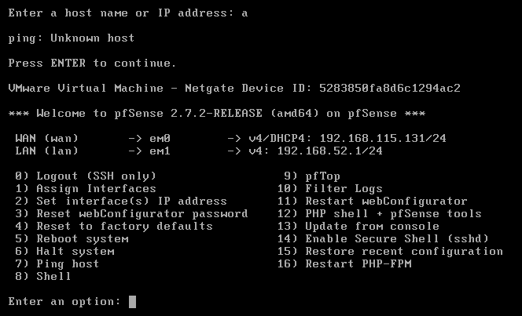

---

## 🌐 Network Topology & IP Allocation

| Host / Role | Interface | IP Address | Description |
|---|---|---|---|
| **Physical Host (PC)** | VMnet8 (NAT Switch) | `192.168.115.1` | External Management / Audit Client |
| **pfSense Appliance** | WAN (VMnet8) | `192.168.115.131` *(Static)* | Perimeter Firewall & Default Gateway |
| **pfSense Appliance** | LAN (VMnet1) | `192.168.52.1` *(Static)* | Core Router / Internal Gateway |
| **Ubuntu Server VM** | LAN (VMnet1) | `192.168.52.2` *(Static via Netplan)* | Nginx Web Server (Linux Backend) |
| **Windows 11 VM** | LAN (VMnet1) | `192.168.52.3` *(Static)* | Enterprise Administration Client (RDP Target) |
| **Windows 11 VM** | LAN (VMnet1) | `192.168.52.x` *(DHCP)* | Internal Test Client (SSH, HTTP & RDP validation) |

```
┌─────────────────────────────────────────────────────────────┐
│                     Physical Host (PC)                      │
│                      192.168.115.1                          │
└───────────────────────────┬─────────────────────────────────┘
                            │ VMnet8 (NAT / WAN Zone)
                            │ 192.168.115.0/24
                ┌───────────▼──────────┐
                │    pfSense Firewall  │
                │  WAN: 192.168.115.131│
                │  LAN: 192.168.52.1   │
                └───────────┬──────────┘
                            │ VMnet1 (Trusted LAN Zone)
                            │ 192.168.52.0/24
        ┌───────────────┬───────────────┐
        │               │               │
┌───────▼──────┐ ┌──────▼───────┐ ┌────▼─────────────┐
│ Ubuntu Server│ │ Windows 11 VM│ │  Windows 11 VM   │
│ 192.168.52.2 │ │ 192.168.52.3 │ │  DHCP (52.x)     │
│ Nginx / SSH  │ │  RDP Target  │ │  Internal Tester │
└──────────────┘ └──────────────┘ └──────────────────┘
```

---

## 🛠️ Technical Implementation

### 1. Virtual Networking & Layer 2 Segregation

Network isolation was enforced at the virtualization layer using **VMware Virtual Network Editor**:

- **VMnet1** `(192.168.52.0/24)` — Trusted **internal LAN core** (Host-only). No endpoints within this zone can reach the outside world without explicit state inspection by the firewall. This segment hosts the Ubuntu Server, the Windows 11 RDP target, and a secondary Windows 11 VM used as an **internal test client** to validate LAN-side connectivity (SSH, HTTP, and RDP) before exposing services through the firewall.
- **VMnet8** `(192.168.115.0/24)` — Untrusted **WAN zone** (NAT). Traffic originating from the physical host enters the perimeter from here.

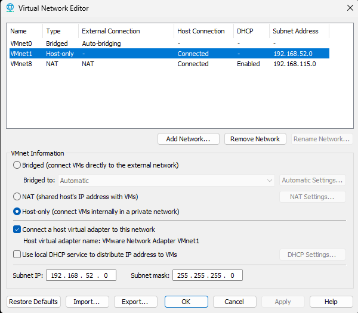

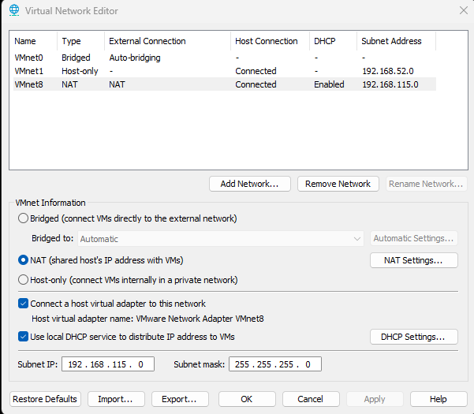

pfSense interface assignment and initial provisioning:

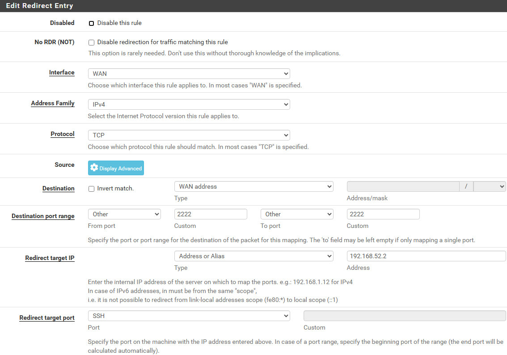

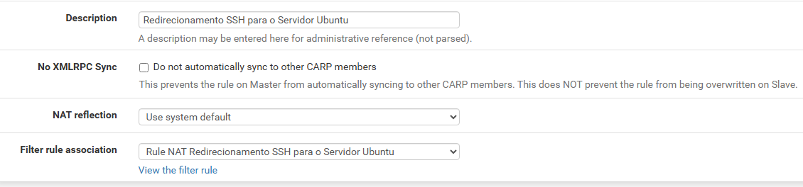

---

### 2. Linux Infrastructure & Static Declarative Routing

On the Ubuntu Server instance, the default network stack was reconfigured using **Netplan** to enforce an immutable networking state. A declarative YAML manifest was used to bind a static IP and explicitly configure a default route pointing to the pfSense LAN interface.

```yaml
# /etc/netplan/00-installer-config.yaml
network:
  version: 2
  ethernets:
    ens33:
      dhcp4: false
      dhcp6: false
      addresses:
        - 192.168.52.2/24
      routes:
        - to: default
          via: 192.168.52.1
      nameservers:
        addresses: [1.1.1.1, 8.8.8.8]
```

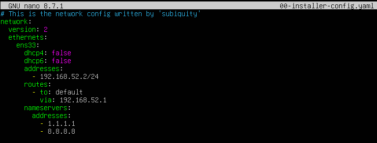

Validating the applied config and kernel routing table (`ip a`):

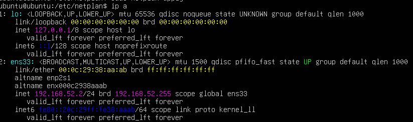

---

### 3. Service Delivery & DNAT Policies (Port Forwarding)

Precise **Destination NAT (DNAT)** rules were crafted to securely expose internal LAN services to the management host (WAN):

| Service | External Port | Internal Target | Internal Port |
|---|---|---|---|
| **HTTP (Nginx)** | `80` | `192.168.52.2` | `80` |
| **SSH** | `2222` | `192.168.52.2` | `22` |
| **RDP** | `3333` | `192.168.52.3` | `3389` |

pfSense gateway and routing configuration:

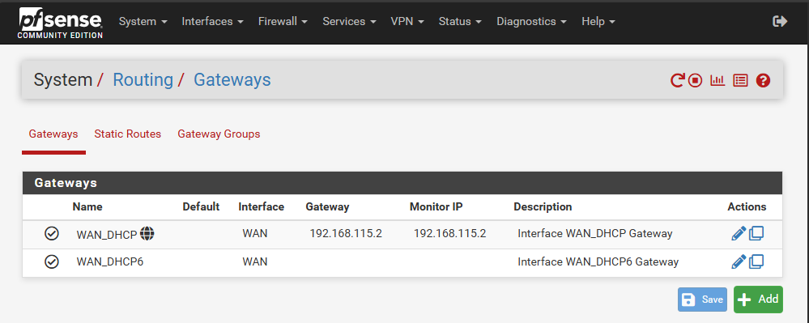

SSH NAT redirect rule (WAN port 2222 → Ubuntu 22):

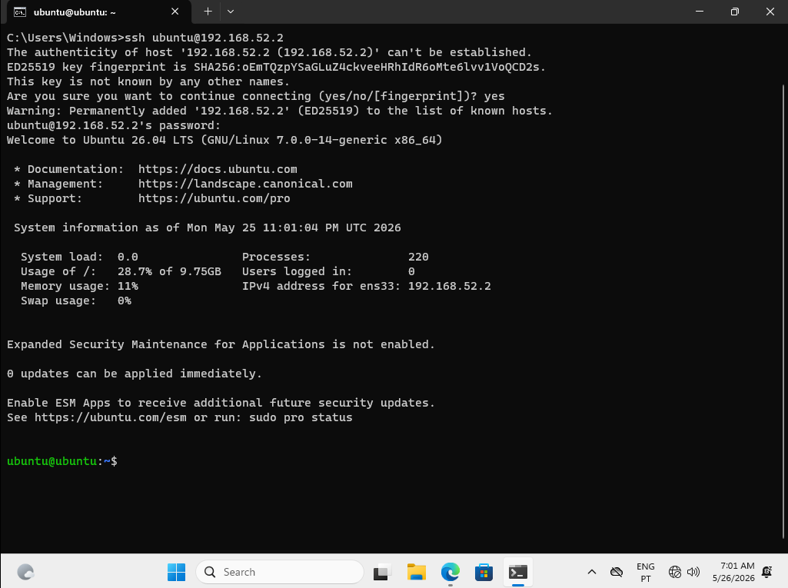

RDP NAT redirect rule (WAN port 3333 → Windows 11 3389):

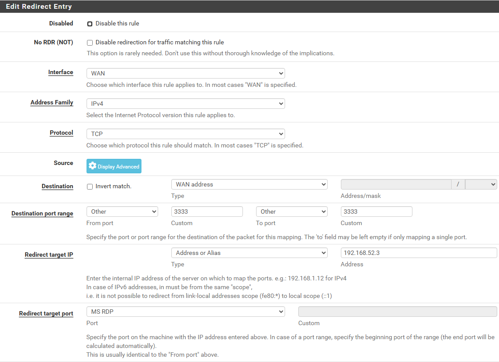

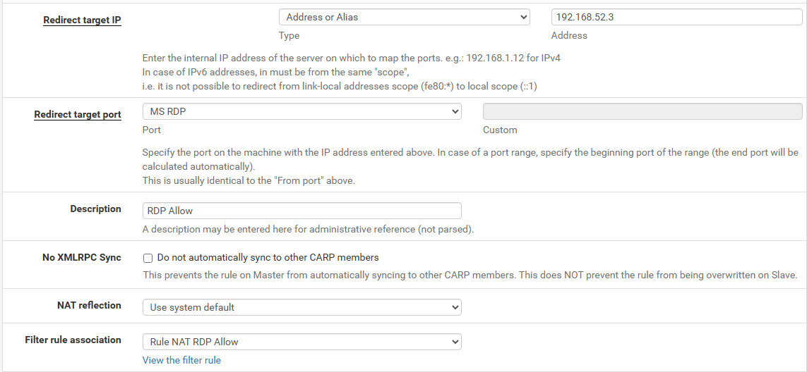

---

## 🔍 Engineering Log: Troubleshooting Case Studies

### Case Study A: Silent Asymmetric Routing Loops & Ghost Handshakes

| | |
|---|---|
| **Symptom** | SSH and HTTP handshakes stopped being dropped but hung indefinitely — connection timeouts |
| **Root Cause** | The Ubuntu server received incoming requests but routed replies through **stale ARP entries / dead cached interface routes** instead of the active pfSense path |
| **Mitigation** | Full hardware interface flush + clean Netplan re-apply |

```bash
# Flush stale interface state
sudo ip addr flush ens33

# Re-trigger clean declarative network state
sudo netplan apply

# Verify symmetric routing
ip route show
ping 192.168.52.1
```

WAN routing validated end-to-end after fix:

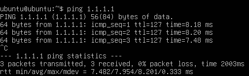

---

### Case Study B: Remote Desktop Handshake Blockade via Native Win11 Security Policies

**NTLM vs NLA Authentication Conflict**

| | |
|---|---|
| **Symptom** | RDP client threw: `Authentication failed because NTLM authentication has been disabled` |
| **Root Cause** | Modern Windows 11 builds strictly disable legacy NTLM for incoming remote connections on local accounts outside of an Active Directory domain, demanding **Network Level Authentication (NLA)** instead |

**Multi-Layer Mitigation:**

1. **Client-side `.rdp` file** — Explicitly bypass CredSSP enforcement:
   ```
   enablecredsspsupport:i:0
   ```

2. **Server-side (Windows 11 VM)** — Disable mandatory NLA via `sysdm.cpl`:
   - `System Properties` → `Remote` tab → Uncheck *"Allow connections only from computers running Remote Desktop with Network Level Authentication"*

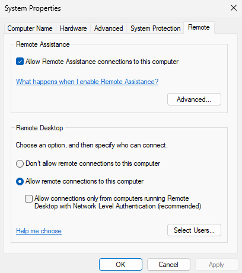

RDP credentials prompt successfully reached after mitigation:

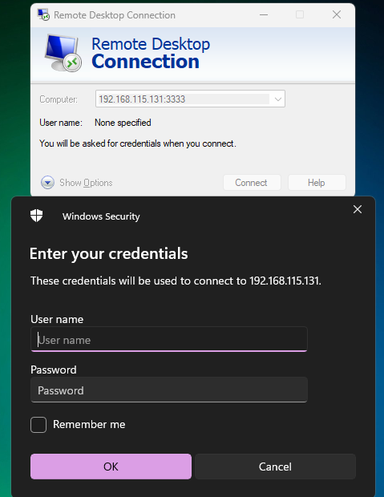

---

## 🧪 Internal LAN Validation

Before exposing any service through the firewall, a secondary **Windows 11 VM** (DHCP-assigned on VMnet1) was used as an internal test client to confirm that all services were reachable and functioning correctly from within the LAN itself.

| Test | From | To | Result |
|---|---|---|---|
| **HTTP** | Windows 11 (DHCP) | `192.168.52.2:80` | ✅ Nginx responding |
| **SSH** | Windows 11 (DHCP) | `192.168.52.2:22` | ✅ Session established |
| **RDP** | Windows 11 (DHCP) | `192.168.52.3:3389` | ✅ Desktop accessible |

This step ensured that any connectivity failure encountered later was isolated to the **firewall/NAT layer**, not the services themselves.

---

## 📊 Deployment Validation & Proof of Concept

### ✅ Active State Tracking and Firewall Log Rules
pfSense successfully logs packet increment and traffic passing through all created rules without drops.

### ✅ Successful Nginx HTTP Access

Accessing the internal Linux web server through the pfSense WAN IP:

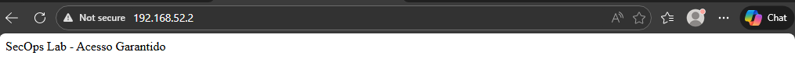

### ✅ Successful Administrative SSH Access

Full SSH session established from the external host via redirected port `2222`:

```bash
ssh ubuntu@192.168.115.131 -p 2222
```

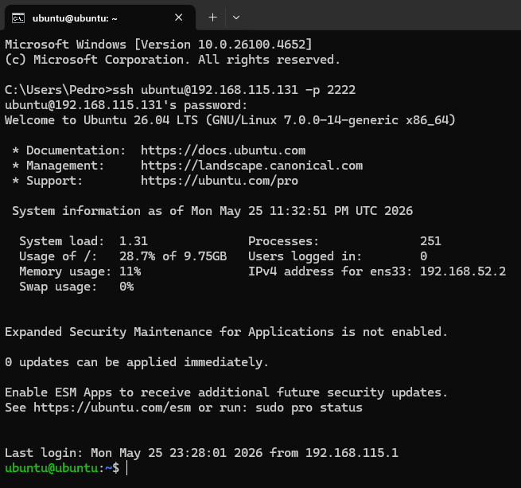

### ✅ End-to-End Remote Desktop (RDP) Success

RDP session established from the physical PC to the isolated Windows 11 VM via custom port `3333`:

```
mstsc /v:192.168.115.131:3333
```

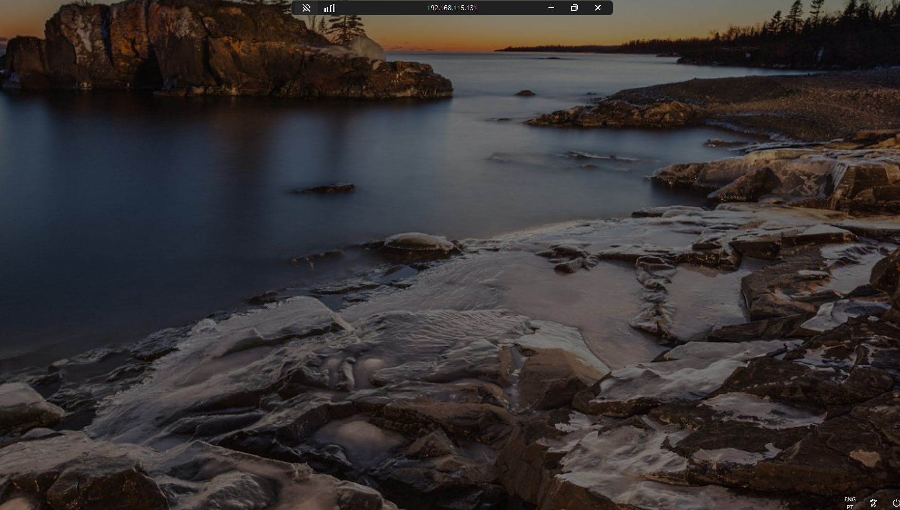

---

## 🧰 Technologies & Tools


---

## 📁 Repository Structure

```
Secure-VLab-Gateway/
├── README.md
├── configs/
│   ├── netplan/
│       └── 00-installer-config.yaml
└── screenshots/
    ├── 01_pfsense_menu.png
    ├── 02_pfsense_settings1.png
    ├── 03_pfsense_settings2.png
    ├── 04_vmnet1_config.png
    ├── 05_vmnet8_config.png
    ├── 06_netplan_config.png
    ├── 07_static_ip_validated.png
    ├── 08_ssh_internal.png
    ├── 09_pfsense_gateways.png
    ├── 10_wan_routing_ok.png
    ├── 11_nginx_access.png
    ├── 12_ssh_external.png
    ├── 13_nat_rdp_rule.png
    ├── 14_nat_rdp_detail.png
    ├── 15_rdp_credentials.png
    ├── 16_nla_disabled.png
    └── 17_rdp_success.png
```

---

*Enterprise perimeter security lab — built for hands-on networking and firewall engineering practice.*
